# DVC Class Assessment — MLOps Solutions & Pipeline Report

**Topic:** Data Version Control (DVC) for Machine Learning Operations (MLOps)  
**Assessment:** DVC Class Assessment — 15 MCQs + 5 Practical Tasks  

---

## Table of Contents
1. [Project Overview & Architecture](#project-overview--architecture)
2. [Directory Structure](#directory-structure)
3. [Part A — MCQ Solutions](#part-a--mcq-solutions)
4. [Part B — Practical Tasks Walkthrough](#part-b--practical-tasks-walkthrough)
   - [Task 1: Track a Dataset Using DVC](#task-1--track-a-dataset-using-dvc)
   - [Task 2: Configure a Local DVC Remote & Data Recovery Flow](#task-2--configure-a-local-dvc-remote--data-recovery-flow)
   - [Task 3: Create a DVC Data Processing Pipeline](#task-3--create-a-dvc-data-processing-pipeline)
   - [Task 4: Detect Changes and Reproduce the Pipeline (Report & Q&A)](#task-4--detect-changes-and-reproduce-the-pipeline-report--qa)
   - [Task 5: Complete Mini ML Pipeline with DVC (Wine Quality)](#task-5--complete-mini-ml-pipeline-with-dvc-wine-quality)
5. [Pipeline DAG Visualizations](#pipeline-dag-visualizations)
6. [How to Reproduce This Project](#how-to-reproduce-this-project)

---

## Project Overview & Architecture

This repository contains the complete practical solutions and documentation for the **DVC Class Assessment**. It demonstrates the modern MLOps paradigm where:
- **Git** tracks source code, pipeline definitions (`dvc.yaml`), dependency hashes (`dvc.lock`), lightweight metadata pointers (`.dvc`), and metric summaries.
- **DVC (Data Version Control)** tracks large raw datasets, intermediate preprocessed data, trained model binaries, and caches execution stages to guarantee 100% reproducibility and prevent redundant computation.

```mermaid
flowchart TD
    subgraph Tasks1_to_4["Tasks 1-4: Titanic Data Preprocessing"]
        T_RAW["data/titanic.csv<br/><i>(Tracked by DVC)</i>"] --> P_TITANIC["Stage: preprocess<br/><code>src/preprocess.py</code>"]
        P_TITANIC --> T_OUT["data/processed.csv<br/><i>(DVC Output)</i>"]
    end

    subgraph Task5["Task 5: Wine Quality End-to-End ML Pipeline"]
        W_RAW["data/winequality.csv<br/><i>(Tracked by DVC)</i>"] --> P_WINE["Stage: preprocess<br/><code>src/preprocess.py</code>"]
        P_WINE --> W_PROC["data/processed.csv"]
        W_PROC --> TRAIN["Stage: train<br/><code>src/train.py</code>"]
        PARAMS["params.yaml<br/><i>(test_size, random_state, n_estimators, max_depth)</i>"] --> TRAIN
        TRAIN --> MODEL["models/model.pkl<br/><i>(RandomForest Model)</i>"]
        TRAIN --> W_TEST["data/test.csv<br/><i>(Test Split)</i>"]
        MODEL --> EVAL["Stage: evaluate<br/><code>src/evaluate.py</code>"]
        W_TEST --> EVAL
        EVAL --> METRICS["metrics.json<br/><i>(Accuracy, F1, Precision, Recall)</i>"]
    end
```



---

## Directory Structure

```text
.
├── .dvc/
│   ├── .gitignore
│   └── config                  # Configured local DVC remote storage
├── dvc-storage/                # Task 2: Local DVC remote storage directory
├── data/
│   ├── .gitignore              # Automatically ignores raw & processed CSVs from Git
│   ├── titanic.csv             # Titanic dataset (Tracked via DVC)
│   ├── titanic.csv.dvc         # DVC metadata pointer (Committed to Git)
│   ├── winequality.csv         # Wine quality dataset (Tracked via DVC)
│   ├── winequality.csv.dvc     # DVC metadata pointer (Committed to Git)
│   ├── processed.csv           # Cleaned dataset (DVC artifact)
│   └── test.csv                # Evaluation test split (DVC artifact)
├── models/
│   ├── .gitignore              # Ignores large model binary
│   └── model.pkl               # Trained RandomForest classifier (DVC artifact)
├── src/
│   ├── generate_datasets.py    # Benchmark dataset generator
│   ├── preprocess.py           # Preprocessing script for Titanic & Wine data
│   ├── train.py                # Hyperparameter-driven model training
│   └── evaluate.py             # Metric evaluation script
├── dvc.yaml                    # Multi-stage reproducible pipeline definition
├── dvc.lock                    # Exact cryptographic hashes of inputs, outputs & params
├── params.yaml                 # Tunable hyperparameters (train stage)
├── metrics.json                # Model performance metrics output
├── DVC_Assessment_Solutions.md  # Part A MCQ Answers & Task 4 Report
└── README.md                   # Complete assessment report & deliverables
```

---

## Part A — MCQ Solutions

The verified answers to all 15 multiple-choice questions from Part A:

| Q# | Question Summary | Correct Option | Explanation |
|---|---|---|---|
| **1** | Primary purpose of DVC | **B** | To version and manage data and ML pipelines |
| **2** | Command to initialize DVC | **B** | `dvc init` |
| **3** | Directory created when DVC is initialized | **B** | `.dvc` |
| **4** | Command to track a dataset with DVC | **B** | `dvc add data.csv` |
| **5** | What happens when running `dvc add data.csv` | **C** | A `.dvc` metadata file is created and raw data is added to `.gitignore` |
| **6** | Why store large datasets outside Git | **B** | Large files make Git repositories heavy and degrade clone/pull performance |
| **7** | File containing metadata for tracked file | **B** | `data.csv.dvc` |
| **8** | Command to download data from DVC remote | **B** | `dvc pull` |
| **9** | Command to upload data to DVC remote | **B** | `dvc push` |
| **10** | Purpose of a DVC remote | **B** | To store DVC-tracked datasets, models, and intermediate artifacts |
| **11** | File used to define a reproducible pipeline | **B** | `dvc.yaml` |
| **12** | Command used to create/update pipeline stage | **A** | `dvc stage add` |
| **13** | Role of `dvc.lock` in DVC | **C** | Records exact versions and cryptographic hashes of pipeline deps and outs |
| **14** | Command used to reproduce a pipeline | **A** | `dvc reproduce` (or `dvc repro`) |
| **15** | Key advantage of combining Git and DVC | **A** | Git manages code while DVC manages large data and models |

*(Also mirrored in [`DVC_Assessment_Solutions.md`](DVC_Assessment_Solutions.md))*

---

## Part B — Practical Tasks Walkthrough

### Task 1 — Track a Dataset Using DVC

#### Objective
Initialize DVC and track the Titanic dataset (`titanic.csv`) separately from Git.

#### Commands Executed
```bash
# 1. Initialize Git and DVC repositories
git init
dvc init

# 2. Generate benchmark Titanic dataset
python src/generate_datasets.py

# 3. Track dataset using DVC
dvc add data/titanic.csv

# 4. Stage and commit DVC metadata into Git
git add .gitignore data/titanic.csv.dvc
git commit -m "Task 1: Initialized DVC and tracked titanic.csv"
```

#### Verification that Git Tracks Metadata, Not the Raw Dataset
1. **Inspecting `data/titanic.csv.dvc`:**
   ```yaml
   outs:
   - md5: 1c51c342be226780d459d205830307b2
     size: 11368
     hash: md5
     path: titanic.csv
   ```
2. **Inspecting `data/.gitignore`:**
   DVC automatically updated `data/.gitignore` with `/titanic.csv`.
3. **Verifying Git tracking:**
   ```bash
   git status
   ```
   **Output:** `nothing to commit, working tree clean`. Git tracks only `data/titanic.csv.dvc` (97 bytes) while ignoring the raw `titanic.csv` dataset.

---

### Task 2 — Configure a Local DVC Remote & Data Recovery Flow

#### Objective
Configure a local directory remote storage and verify the complete data lifecycle:
$$\text{Dataset} \longrightarrow \text{DVC} \longrightarrow \text{Remote Storage} \longrightarrow \text{Delete Local Copy} \longrightarrow \text{Recover via DVC}$$

#### Commands Executed
```bash
# 1. Create a local remote directory
mkdir dvc-storage

# 2. Add local remote to DVC configuration
dvc remote add -d localremote dvc-storage
git add .dvc/config
git commit -m "Configure local DVC remote"

# 3. Push dataset to remote storage
dvc push

# 4. Simulate catastrophic local data loss
Remove-Item data/titanic.csv
Test-Path data/titanic.csv # Returns False

# 5. Recover the dataset from remote storage
dvc pull
Test-Path data/titanic.csv # Returns True
```

#### Execution Evidence
- **DVC push output:**
  ```text
  1 file pushed
  ```
- **File deletion & recovery test:**
  ```powershell
  Remove-Item data\titanic.csv
  python -m dvc pull
  ```
  **Result:**
  ```text
  A       data\titanic.csv
  1 file added
  ```
- **Verification:** `Test-Path data\titanic.csv` returned `True`. The file was fully recovered with intact MD5 hash (`1c51c342be226780d459d205830307b2`).

---

### Task 3 — Create a DVC Data Processing Pipeline

#### Objective
Build a reproducible preprocessing stage for Titanic data that handles missing values, removes redundant columns, encodes categorical variables, and outputs `data/processed.csv`.

#### Pipeline Stage Definition (`dvc.yaml`)
```yaml
stages:
  preprocess:
    cmd: python src/preprocess.py --input data/titanic.csv --output data/processed.csv
    deps:
      - data/titanic.csv
      - src/preprocess.py
    outs:
      - data/processed.csv
```

#### Preprocessing Logic (`src/preprocess.py`)
- Reads `data/titanic.csv`
- Drops uninformative identifiers: `PassengerId`, `Name`, `Ticket`, `Cabin`
- Imputes missing numerical values (`Age`, `Fare`) with median
- Imputes missing categorical values (`Embarked`) with mode
- Encodes categorical feature `Sex` (`male: 0, female: 1`)
- Applies dummy encoding to `Embarked` (`drop_first=True`)
- Saves clean dataset to `data/processed.csv`

#### Running the Pipeline
```bash
dvc repro
```
**Output:**
```text
Running stage 'preprocess':
> python src/preprocess.py --input data/titanic.csv --output data/processed.csv
Reading raw data from data/titanic.csv...
Successfully processed data saved to data/processed.csv. Shape: (200, 9)
Generating lock file 'dvc.lock'
Updating lock file 'dvc.lock'
```
Both `dvc.yaml` and `dvc.lock` were successfully generated and committed to Git.

---

### Task 4 — Detect Changes and Reproduce the Pipeline (Report & Q&A)

#### Objective
Demonstrate how DVC detects changes across **code**, **data**, and **parameters**, executing only the necessary stages.

#### Experiment 1: Modifying Preprocessing Code
1. Added logging statements to `src/preprocess.py`.
2. Executed `dvc status`:
   ```text
   preprocess:
       changed deps:
           modified:           src\preprocess.py
   ```
3. Executed `dvc repro`:
   ```text
   Running stage 'preprocess':
   > python src/preprocess.py --input data/titanic.csv --output data/processed.csv
   [Task 4 Logger] Preprocessing execution initiated...
   Reading raw data from data/titanic.csv...
   Successfully processed data saved to data/processed.csv. Shape: (200, 9)
   Updating lock file 'dvc.lock'
   ```
   **Observation:** Only the `preprocess` stage re-executed.

#### Experiment 2: Modifying Input Dataset
1. Appended a row to `data/titanic.csv` and re-added with `dvc add data/titanic.csv`.
2. Executed `dvc status`:
   ```text
   preprocess:
       changed deps:
           modified:           data\titanic.csv
   ```
3. Executed `dvc repro`:
   ```text
   Running stage 'preprocess':
   > python src/preprocess.py --input data/titanic.csv --output data/processed.csv
   [Task 4 Logger] Preprocessing execution initiated...
   Reading raw data from data/titanic.csv...
   Successfully processed data saved to data/processed.csv. Shape: (201, 9)
   Updating lock file 'dvc.lock'
   ```
   **Observation:** DVC recognized that the dataset MD5 changed, triggered the stage, and processed the updated row count (201).

---

#### Comprehensive Q&A

##### Q1: Why did DVC decide to execute the stage again?
> **Answer:**  
> DVC tracks every stage by computing cryptographic hashes (MD5) of all declared dependencies (`deps`: source code files, input data files, parameters). When `dvc repro` is triggered:
> 1. DVC computes current MD5 hashes for all declared inputs.
> 2. It compares these hashes against the recorded hashes stored in `dvc.lock`.
> 3. If any hash differs (due to modified code, updated data, or changed hyperparameter values), DVC flags the stage as **stale** and executes its command. Downstream stages that depend on that stage's outputs are also re-executed.

##### Q2: What information is stored in `dvc.lock`?
> **Answer:**  
> `dvc.lock` is DVC's state manifest. For each stage, it records:
> - **Stage Command (`cmd`)**: The exact CLI command executed.
> - **Dependencies (`deps`)**: Relative file paths, hash algorithm (`md5`), the exact hash string, and file size in bytes.
> - **Parameters (`params`)**: The resolved key-value pairs from `params.yaml` used during that run.
> - **Outputs (`outs`)**: Relative path, hash algorithm (`md5`), output hash string, and file size in bytes.  
> It acts as the immutable cryptographic "receipt" linking specific versions of code, data, and parameters to specific outputs.

##### Q3: What happens if neither the input data nor processing code changes?
> **Answer:**  
> If no dependencies or parameters have changed:
> - `dvc status` outputs: `Data and pipelines are up to date.`
> - `dvc repro` detects that all hashes match `dvc.lock`, logs `Stage '<stage_name>' didn't change, skipping`, and finishes immediately without running any commands.  
> This acts as an intelligent build cache, saving compute time and resources.

##### Q4: Why is reproducibility important in ML projects?
> **Answer:**  
> Unlike traditional software engineering where outputs depend only on source code, Machine Learning outputs are a joint function of:
> $$\text{Model Artifact} = f(\text{Code}, \text{Data}, \text{Hyperparameters}, \text{Environment})$$
> Reproducibility is vital because:
> 1. **Auditability & Compliance:** Regulations (e.g., healthcare, finance) require proving how a model was trained and on what exact dataset version.
> 2. **Debugging & Regression Tracking:** When model accuracy degrades in production, teams must be able to roll back to the exact data + code state that produced the previous model.
> 3. **Collaboration:** Eliminates the "works on my machine" dilemma by enabling teammates to pull the exact data version and re-run pipelines deterministically.
> 4. **Preventing Data Leakage & Drift:** Ensures experiments are compared under fair, identical conditions.

---

### Task 5 — Complete Mini ML Pipeline with DVC (Wine Quality)

#### Objective
Build a complete 3-stage reproducible machine learning pipeline predicting wine quality:
$$\text{Raw Data} \longrightarrow \text{Preprocessing} \longrightarrow \text{Train/Test Split \& Model Training} \longrightarrow \text{Evaluation} \longrightarrow \text{metrics.json}$$

#### Pipeline Stages in `dvc.yaml`
```yaml
stages:
  preprocess:
    cmd: python src/preprocess.py --input data/winequality.csv --output data/processed.csv
    deps:
      - data/winequality.csv
      - src/preprocess.py
    outs:
      - data/processed.csv

  train:
    cmd: python src/train.py
    deps:
      - data/processed.csv
      - src/train.py
    params:
      - train.max_depth
      - train.n_estimators
      - train.random_state
      - train.test_size
    outs:
      - data/test.csv
      - models/model.pkl

  evaluate:
    cmd: python src/evaluate.py
    deps:
      - data/test.csv
      - models/model.pkl
      - src/evaluate.py
    metrics:
      - metrics.json:
          cache: false
```

#### Hyperparameters (`params.yaml`)
```yaml
preprocess:
  input_path: "data/winequality.csv"
  output_path: "data/processed.csv"

train:
  test_size: 0.2
  random_state: 42
  n_estimators: 150
  max_depth: 7

evaluate:
  threshold: 0.5
```

#### Evaluation Metrics (`metrics.json`)
```json
{
    "accuracy": 0.6667,
    "f1_score": 0.5,
    "precision": 0.7143,
    "recall": 0.3846
}
```

#### Pipeline Inspection Commands & Terminal Outputs

1. **Pipeline Execution (`dvc repro`):**
   ```text
   'data\winequality.csv.dvc' didn't change, skipping
   Stage 'preprocess' didn't change, skipping
   Running stage 'train':
   > python src/train.py
   Model trained successfully and saved to models/model.pkl
   Test split saved to data/test.csv with 60 samples
   Updating lock file 'dvc.lock'

   Running stage 'evaluate':
   > python src/evaluate.py
   Evaluation complete. Metrics saved to metrics.json: {'accuracy': 0.6667, 'f1_score': 0.5, 'precision': 0.7143, 'recall': 0.3846}
   Updating lock file 'dvc.lock'
   ```

2. **Pipeline Status (`dvc status`):**
   ```text
   Data and pipelines are up to date.
   ```

3. **Metrics Display (`dvc metrics show`):**
   ```text
   Path          accuracy    f1_score    precision    recall
   metrics.json  0.6667      0.5         0.7143       0.3846
   ```

4. **Demonstrating Parameter Modification Detection:**
   When `train.n_estimators` in `params.yaml` was modified from 100 to 150 and `max_depth` from 5 to 7:
   ```text
   train:
       changed deps:
           params.yaml:
               modified: train.max_depth
               modified: train.n_estimators
   ```
   Running `dvc repro` cleanly skipped `preprocess` (cached), executing only `train` and `evaluate`, resulting in an accuracy increase from **0.6167** to **0.6667**.

---

## Pipeline DAG Visualizations

### Text DAG (`dvc dag`)
```text
+--------------------------+ 
| data\winequality.csv.dvc | 
+--------------------------+ 
              *              
              *              
              *              
       +------------+        
       | preprocess |        
       +------------+        
              *              
              *              
              *              
          +-------+          
          | train |          
          +-------+          
              *              
              *              
              *              
        +----------+         
        | evaluate |         
        +----------+         
+----------------------+ 
| data\titanic.csv.dvc | 
+----------------------+ 
```

---

## How to Reproduce This Project

```bash
# 1. Navigate to project directory
cd DVC

# 2. Activate virtual environment
.\venv\Scripts\activate

# 3. Pull datasets and model artifacts from local DVC remote
python -m dvc pull

# 4. Reproduce the full pipeline
python -m dvc repro

# 5. Inspect evaluation metrics and DAG structure
python -m dvc metrics show
python -m dvc dag
```
