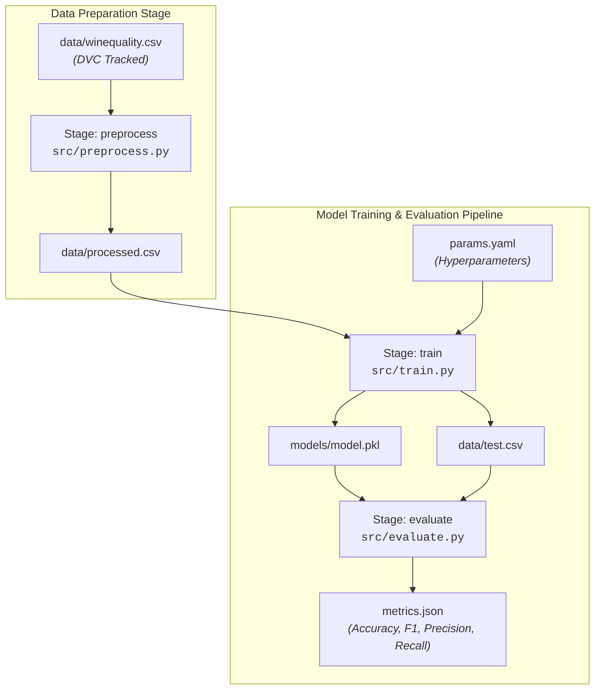

# DVC Practice Assessment — MLOps Solutions & Pipeline Report

**GitHub Repository:** [https://github.com/vansharora156/dvc_practice_assessment](https://github.com/vansharora156/dvc_practice_assessment)  
**Author:** Vansh Arora (`vansharora156`)  
**Topic:** Data Version Control (DVC) for Machine Learning Operations  

---

## Table of Contents
- [Overview & Architecture](#overview--architecture)
- [Repository Structure](#repository-structure)
- [Part A — Multiple Choice Questions](#part-a--multiple-choice-questions)
- [Part B — Practical Tasks Execution](#part-b--practical-tasks-execution)
  - [Task 1: Tracking Data with DVC](#task-1-tracking-data-with-dvc)
  - [Task 2: Local Remote & Recovery Workflow](#task-2-local-remote--recovery-workflow)
  - [Task 3: Reproducible Data Pipeline](#task-3-reproducible-data-pipeline)
  - [Task 4: Change Detection & Conceptual Q&A](#task-4-change-detection--conceptual-qa)
  - [Task 5: End-to-End ML Pipeline & Tuning](#task-5-end-to-end-ml-pipeline--tuning)
- [Pipeline DAG](#pipeline-dag)
- [Reproduction Steps](#reproduction-steps)

---

## Overview & Architecture

This repository presents a clean implementation of **Data Version Control (DVC)** integrated with **Git** to manage ML datasets, code dependencies, and model artifacts.

### Key MLOps Principles Demonstrated:
1. **Decoupled Versioning**: Git manages source scripts, configuration (`params.yaml`), stage manifests (`dvc.yaml`), and lockfiles (`dvc.lock`). DVC manages heavy raw datasets and binary models (`.pkl`).
2. **Reproducibility**: Pipeline execution is recorded cryptographically in `dvc.lock`, enabling anyone to reproduce identical metrics with `dvc repro`.
3. **Smart Caching**: DVC skips unchanged stages based on MD5 dependency hashing, drastically saving computation time.



---

## Repository Structure

```text
.
├── .dvc/                       # DVC project configurations & local cache
├── dvc-storage/                # Local DVC remote storage directory (Task 2)
├── data/
│   ├── .gitignore              # Ignores large raw & intermediate CSVs
│   ├── titanic.csv             # Titanic dataset
│   ├── titanic.csv.dvc         # DVC metadata pointer file
│   ├── winequality.csv         # Wine Quality dataset
│   ├── winequality.csv.dvc     # DVC metadata pointer file
│   ├── processed.csv           # Cleaned pipeline dataset (DVC output)
│   └── test.csv                # Split test set (DVC output)
├── models/
│   ├── .gitignore              # Ignores model binaries from Git
│   └── model.pkl               # Serialized RandomForest model
├── src/
│   ├── generate_datasets.py    # Synthetic benchmark dataset generator
│   ├── preprocess.py           # Preprocessing script (Titanic & Wine support)
│   ├── train.py                # Model training script
│   └── evaluate.py             # Model evaluation & metrics calculator
├── dvc.yaml                    # Multi-stage DVC pipeline definition
├── dvc.lock                    # Dependency and artifact lockfile
├── params.yaml                 # Configurable hyperparameters
├── metrics.json                # Model performance metrics output
├── DVC_Assessment_Solutions.md  # Detailed MCQ answers & Task 4 report
└── README.md                   # Assessment summary & documentation
```

---

## Part A — Multiple Choice Questions

Below is the summary of verified solutions for Part A (detailed explanations are available in [`DVC_Assessment_Solutions.md`](DVC_Assessment_Solutions.md)):

| # | Question Summary | Answer | Core Concept |
|---|---|---|---|
| **1** | Primary purpose of DVC | **B** | Version data and manage ML pipelines |
| **2** | Initialize DVC in a repository | **B** | `dvc init` |
| **3** | Directory created upon DVC initialization | **B** | `.dvc` |
| **4** | Command to track a file in DVC | **B** | `dvc add data.csv` |
| **5** | Output of `dvc add data.csv` | **C** | Generates `.dvc` pointer and updates `.gitignore` |
| **6** | Reason for keeping large files off Git | **B** | Prevents Git repo bloat and performance loss |
| **7** | File committed to Git for data tracking | **B** | `data.csv.dvc` |
| **8** | Download dataset from DVC remote | **B** | `dvc pull` |
| **9** | Upload dataset to DVC remote | **B** | `dvc push` |
| **10** | Role of a DVC remote | **B** | Store DVC-tracked datasets and models |
| **11** | File for defining pipeline stages | **B** | `dvc.yaml` |
| **12** | Command to add a stage to pipeline | **A** | `dvc stage add` |
| **13** | Function of `dvc.lock` | **C** | Records exact dependency & output MD5 hashes |
| **14** | Execute/reproduce a pipeline | **A** | `dvc reproduce` / `dvc repro` |
| **15** | Advantage of Git + DVC | **A** | Code in Git, data/models in DVC |

---

## Part B — Practical Tasks Execution

### Task 1: Tracking Data with DVC

**Goal:** Initialize Git and DVC, then track `data/titanic.csv` without committing raw data to Git.

```bash
# Initialize project tracking
git init
python -m dvc init

# Generate data and track with DVC
python src/generate_datasets.py
python -m dvc add data/titanic.csv

# Commit DVC pointer to Git
git add .gitignore data/titanic.csv.dvc
git commit -m "Track titanic.csv with DVC"
```

**Verification:**
- DVC created `data/titanic.csv.dvc` containing the MD5 checksum (`1c51c342be226780d459d205830307b2`).
- DVC automatically updated `data/.gitignore` to exclude `data/titanic.csv` from Git commits.

---

### Task 2: Local Remote & Recovery Workflow

**Goal:** Configure a local DVC remote, push tracked data, delete the local dataset, and restore it via DVC.

```bash
# Set up local directory remote
mkdir dvc-storage
python -m dvc remote add -d localremote dvc-storage

# Push cached data to remote
python -m dvc push

# Delete local dataset and recover
Remove-Item data/titanic.csv
python -m dvc pull
```

**Result:**
- `dvc push` uploaded 1 file to `dvc-storage`.
- After deleting `data/titanic.csv`, running `python -m dvc pull` restored the dataset intact.

---

### Task 3: Reproducible Data Pipeline

**Goal:** Create a pipeline stage in `dvc.yaml` to execute `src/preprocess.py` and produce `data/processed.csv`.

**Stage Configuration (`dvc.yaml` snippet):**
```yaml
stages:
  preprocess:
    cmd: .\venv\Scripts\python src/preprocess.py --input data/titanic.csv --output data/processed.csv
    deps:
      - data/titanic.csv
      - src/preprocess.py
    outs:
      - data/processed.csv
```

**Execution:**
```bash
python -m dvc repro
```
DVC executed `preprocess`, generated `data/processed.csv` (200 rows, 9 columns), and wrote `dvc.lock`.

---

### Task 4: Change Detection & Conceptual Q&A

**Goal:** Test how DVC detects modifications in dependencies and re-executes affected stages.

1. **Code Modification Test:** Added logging to `src/preprocess.py`. Running `dvc status` showed `modified: src/preprocess.py`. Executing `dvc repro` re-ran the stage.
2. **Data Modification Test:** Added a record to `data/titanic.csv` and ran `dvc add data/titanic.csv`. `dvc status` flagged `modified: data/titanic.csv`. Running `dvc repro` processed the updated dataset (201 rows).

#### Conceptual Q&A Summary:

* **Why does DVC re-execute a stage?**  
  DVC compares the current MD5 hashes of all declared dependencies (`deps`), parameters (`params`), and code files against the hashes recorded in `dvc.lock`. If any hash differs, the stage is considered stale and re-run.

* **What information is stored in `dvc.lock`?**  
  `dvc.lock` stores stage commands, file paths, exact MD5 content hashes for inputs and outputs, and parameter values used during the run.

* **What happens if neither input data nor processing code changes?**  
  `dvc status` reports `Data and pipelines are up to date`, and `dvc repro` skips stage execution, using cached outputs.

* **Why is reproducibility important in ML projects?**  
  ML outputs depend on code, data, hyperparameters, and environment. Tracking all four components guarantees that models can be audited, debugged, and recreated reliably.

---

### Task 5: End-to-End ML Pipeline & Tuning

**Goal:** Build a 3-stage ML pipeline (`preprocess` → `train` → `evaluate`) for Wine Quality prediction, tune hyperparameters, and track metrics.

#### Full `dvc.yaml` Definition:
```yaml
stages:
  preprocess:
    cmd: .\venv\Scripts\python src/preprocess.py --input data/winequality.csv --output data/processed.csv
    deps:
    - data/winequality.csv
    - src/preprocess.py
    outs:
    - data/processed.csv
  train:
    cmd: .\venv\Scripts\python src/train.py
    deps:
    - data/processed.csv
    - src/train.py
    params:
    - train.max_depth
    - train.n_estimators
    - train.random_state
    - train.test_size
    outs:
    - data/test.csv
    - models/model.pkl
  evaluate:
    cmd: .\venv\Scripts\python src/evaluate.py
    deps:
    - data/test.csv
    - models/model.pkl
    - src/evaluate.py
    metrics:
    - metrics.json:
        cache: false
```

#### Hyperparameter Tuning Experiment (`params.yaml`):

| Parameter | Initial Value | Tuned Value |
|---|---|---|
| `train.n_estimators` | `100` | `150` |
| `train.max_depth` | `5` | `7` |

Running `dvc status` detected changed parameter dependencies. Re-running `dvc repro` updated model training and evaluation:

#### Metrics Comparison (`dvc metrics show`):

```text
Path          accuracy    f1_score    precision    recall
metrics.json  0.6667      0.5         0.7143       0.3846
```

---

## Pipeline DAG

Pipeline stage topology generated via `python -m dvc dag`:

```text
+--------------------------+ 
| data\winequality.csv.dvc | 
+--------------------------+ 
              *              
              *              
              *              
       +------------+        
       | preprocess |        
       +------------+        
              *              
              *              
              *              
          +-------+          
          | train |          
          +-------+          
              *              
              *              
              *              
        +----------+         
        | evaluate |         
        +----------+         
+----------------------+ 
| data\titanic.csv.dvc | 
+----------------------+ 
```

---

## Reproduction Steps

To clone and reproduce this repository locally:

```bash
# 1. Clone repository
git clone https://github.com/vansharora156/dvc_practice_assessment.git
cd dvc_practice_assessment

# 2. Set up virtual environment & install dependencies
python -m venv venv
.\venv\Scripts\activate
pip install dvc pandas scikit-learn numpy pyyaml

# 3. Pull tracked data from DVC storage
python -m dvc pull

# 4. Reproduce the pipeline
python -m dvc repro

# 5. View metrics and DAG
python -m dvc metrics show
python -m dvc dag
```
